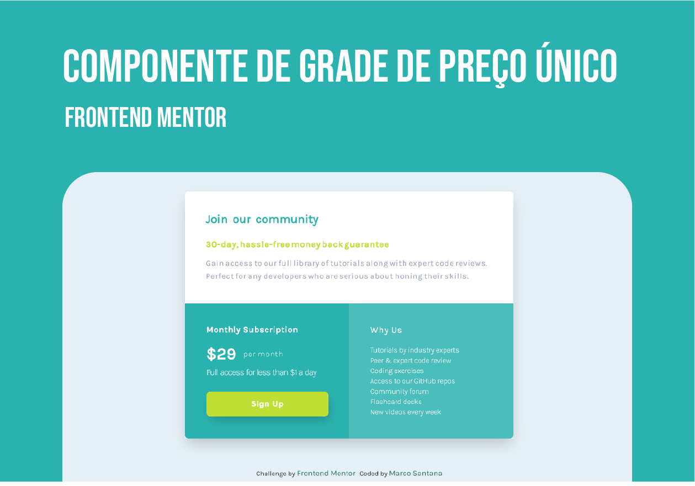

# Frontend Mentor - Solução de componente de grade de preço únicos

Esta é uma solução para o [Single price grid component challenge on Frontend Mentor](https://www.frontendmentor.io/challenges/single-price-grid-component-5ce41129d0ff452fec5abbbc). Os desafios do Frontend Mentor nos ajudam a melhorar nossas habilidades de codificação ao construir projetos realistas.

## Índice

- [Frontend Mentor - Solução de componente de grade de preço únicos](#frontend-mentor---solução-de-componente-de-grade-de-preço-únicos)
  - [Índice](#índice)
  - [Visão geral](#visão-geral)
    - [**O desafio**](#o-desafio)
    - [Captura de tela](#captura-de-tela)
    - [**Links**](#links)
  - [Meu processo](#meu-processo)
    - [**Construído com**](#construído-com)
    - [**O que eu aprendi**](#o-que-eu-aprendi)
    - [**Desenvolvimento continuado**](#desenvolvimento-continuado)
    - [**Recursos úteis**](#recursos-úteis)
  - [Autor](#autor)

## Visão geral

### **O desafio**

Os usuários devem ser capazes de:

- Ver o layout ideal para o componente, dependendo do tamanho da tela do dispositivo
- Ver um estado de foco na área de trabalho para a frase de chamariz inscreva-se

### Captura de tela

### **Links**

- URL da solução: [Add solution URL here](https://your-solution-url.com)
- Live Site URL: [Add live site URL here](https://your-live-site-url.com)

## Meu processo

### **Construído com**

- HTML5
- CSS
- Flexbox
- CSS Grid
- Animation CSS
- Mobile-first

### **O que eu aprendi**

Este desafio foi realizado visualizando uma imagem JPG do layout proposto, tendo que desenvolver a página apenas olhando e suponto os pixels e espaçamentos, más no artigo do [ApplePieGiraffe](https://applepiegiraffe.hashnode.dev/frontend-mentor-guide-2021) ele cita uma extensão muito bacana no chrome chamada [PerfectPixel](https://chrome.google.com/webstore/detail/perfectpixel-by-welldonec/dkaagdgjmgdmbnecmcefdhjekcoceebi?hl=en-US) com ela você pode carregar uma imagem do layout de forma transparente na tela e posicioná-la acima do seu projeto, assim facilitando no desenvolvimento.😁

### **Desenvolvimento continuado**

Para soluções futuras e conforme for aumentando o nível de complexidade, pretendo encaixar animações de forma forma que faça sentido ao contexto das páginas e, explorar o CSS Grid.

### **Recursos úteis**

- [Artigo: Como obter o máximo do Frontend Mentor ](https://medium.com/frontend-mentor/how-to-get-the-most-out-of-frontend-mentor-bdd6fdc25cb8) - Se você deseja saber sobre o que é o Frontend Mentor, neste artigo você aprendera muito sobre. Nele pude extrair a importância de realizar desafios e a praticar começando do básico, sem se preocupar com o tempo de desenvolvimento e focando na qualidade de entrega de uma solução. Também esclarece muito, sobre a importância e evolução na escrita de um bom README, espero estar indo bem 😄.

## Autor

- Frontend Mentor - [@300Marco](https://www.frontendmentor.io/profile/300Marco)
